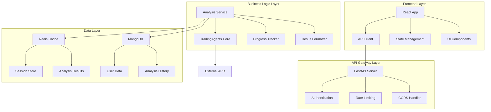

# Design Document

## Overview

本设计文档描述了将现有基于 Streamlit 的股票分析平台迁移到现代 Web 框架的技术方案。我们将采用 FastAPI + React 的前后端分离架构，保持现有的 TradingAgents 核心逻辑不变，重新设计 Web 界面和 API 层。

### 技术栈选择

**后端框架：FastAPI**
- 高性能异步 Web 框架
- 自动生成 OpenAPI 文档
- 内置数据验证和序列化
- 优秀的 WebSocket 支持
- 与现有 Python 生态系统兼容

**前端框架：React + TypeScript**
- 现代化组件化开发
- 丰富的生态系统和 UI 库
- 优秀的开发工具和调试支持
- 强类型支持提高代码质量

**状态管理：Zustand**
- 轻量级状态管理库
- 简单易用，学习成本低
- 支持 TypeScript

**UI 组件库：Ant Design**
- 企业级 UI 设计语言
- 丰富的组件库
- 优秀的表格和图表组件

**图表库：Apache ECharts**
- 强大的数据可视化能力
- 支持多种图表类型
- 良好的交互体验

## Architecture

### 整体架构



### 前后端分离架构

**前端职责：**
- 用户界面渲染和交互
- 状态管理和数据缓存
- 实时进度显示
- 图表和数据可视化

**后端职责：**
- API 接口提供
- 业务逻辑处理
- 数据持久化
- 异步任务管理

### 微服务设计

虽然初期采用单体架构，但设计时考虑未来的微服务拆分：

1. **认证服务**：用户认证和权限管理
2. **分析服务**：股票分析核心逻辑
3. **配置服务**：系统配置管理
4. **通知服务**：实时通知和进度推送

## Components and Interfaces

### 后端组件

#### 1. FastAPI 应用结构

```
backend/
├── app/
│   ├── __init__.py
│   ├── main.py              # FastAPI 应用入口
│   ├── config.py            # 配置管理
│   ├── dependencies.py      # 依赖注入
│   └── middleware.py        # 中间件
├── api/
│   ├── __init__.py
│   ├── v1/
│   │   ├── __init__.py
│   │   ├── auth.py          # 认证相关 API
│   │   ├── analysis.py      # 分析相关 API
│   │   ├── config.py        # 配置相关 API
│   │   └── websocket.py     # WebSocket 连接
├── core/
│   ├── __init__.py
│   ├── auth.py              # 认证逻辑
│   ├── security.py          # 安全相关
│   └── exceptions.py        # 异常处理
├── services/
│   ├── __init__.py
│   ├── analysis_service.py  # 分析服务
│   ├── config_service.py    # 配置服务
│   └── user_service.py      # 用户服务
├── models/
│   ├── __init__.py
│   ├── user.py              # 用户模型
│   ├── analysis.py          # 分析模型
│   └── config.py            # 配置模型
└── utils/
    ├── __init__.py
    ├── logger.py            # 日志工具
    └── helpers.py           # 辅助函数
```

#### 2. 核心 API 接口

**认证 API**
```python
POST /api/v1/auth/login
POST /api/v1/auth/logout
GET  /api/v1/auth/me
POST /api/v1/auth/refresh
```

**分析 API**
```python
POST /api/v1/analysis/start          # 开始分析
GET  /api/v1/analysis/{id}/status    # 获取分析状态
GET  /api/v1/analysis/{id}/result    # 获取分析结果
GET  /api/v1/analysis/history        # 获取历史记录
DELETE /api/v1/analysis/{id}         # 删除分析记录
```

**配置 API**
```python
GET  /api/v1/config/llm              # 获取 LLM 配置
PUT  /api/v1/config/llm              # 更新 LLM 配置
GET  /api/v1/config/data-sources     # 获取数据源配置
PUT  /api/v1/config/data-sources     # 更新数据源配置
```

**WebSocket 接口**
```python
WS /api/v1/ws/analysis/{id}          # 分析进度推送
WS /api/v1/ws/notifications          # 系统通知推送
```

#### 3. 数据模型

**用户模型**
```python
class User(BaseModel):
    id: str
    username: str
    email: Optional[str]
    role: UserRole
    permissions: List[str]
    created_at: datetime
    last_login: Optional[datetime]
```

**分析请求模型**
```python
class AnalysisRequest(BaseModel):
    stock_code: str
    market_type: str
    analysis_date: Optional[str]
    analysts: List[str]
    llm_config: Optional[Dict[str, Any]]
```

**分析结果模型**
```python
class AnalysisResult(BaseModel):
    id: str
    user_id: str
    stock_code: str
    status: AnalysisStatus
    progress: float
    result_data: Optional[Dict[str, Any]]
    created_at: datetime
    completed_at: Optional[datetime]
```

### 前端组件

#### 1. React 应用结构

```
frontend/
├── public/
│   ├── index.html
│   └── favicon.ico
├── src/
│   ├── components/           # 通用组件
│   │   ├── Layout/
│   │   ├── Charts/
│   │   ├── Forms/
│   │   └── Common/
│   ├── pages/               # 页面组件
│   │   ├── Login/
│   │   ├── Dashboard/
│   │   ├── Analysis/
│   │   └── Config/
│   ├── services/            # API 服务
│   │   ├── api.ts
│   │   ├── auth.ts
│   │   └── websocket.ts
│   ├── stores/              # 状态管理
│   │   ├── authStore.ts
│   │   ├── analysisStore.ts
│   │   └── configStore.ts
│   ├── types/               # TypeScript 类型
│   │   ├── api.ts
│   │   ├── user.ts
│   │   └── analysis.ts
│   ├── utils/               # 工具函数
│   │   ├── helpers.ts
│   │   └── constants.ts
│   ├── hooks/               # 自定义 Hooks
│   │   ├── useAuth.ts
│   │   ├── useAnalysis.ts
│   │   └── useWebSocket.ts
│   ├── App.tsx
│   └── index.tsx
├── package.json
└── tsconfig.json
```

#### 2. 核心组件设计

**布局组件**
- `MainLayout`: 主布局，包含导航和侧边栏
- `AuthLayout`: 认证页面布局
- `Header`: 顶部导航栏
- `Sidebar`: 侧边栏导航

**业务组件**
- `AnalysisForm`: 分析参数配置表单
- `AnalysisProgress`: 实时进度显示
- `ResultDisplay`: 分析结果展示
- `ChartViewer`: 图表查看器
- `ConfigPanel`: 配置管理面板

**通用组件**
- `LoadingSpinner`: 加载指示器
- `ErrorBoundary`: 错误边界
- `ConfirmDialog`: 确认对话框
- `NotificationCenter`: 通知中心

#### 3. 状态管理设计

**认证状态**
```typescript
interface AuthState {
  user: User | null;
  token: string | null;
  isAuthenticated: boolean;
  login: (credentials: LoginCredentials) => Promise<void>;
  logout: () => void;
  refreshToken: () => Promise<void>;
}
```

**分析状态**
```typescript
interface AnalysisState {
  currentAnalysis: Analysis | null;
  analysisHistory: Analysis[];
  isLoading: boolean;
  startAnalysis: (request: AnalysisRequest) => Promise<void>;
  getAnalysisStatus: (id: string) => Promise<void>;
  getAnalysisResult: (id: string) => Promise<void>;
}
```

## Data Models

### 数据库设计

#### MongoDB 集合

**用户集合 (users)**
```json
{
  "_id": "ObjectId",
  "username": "string",
  "email": "string",
  "password_hash": "string",
  "role": "admin|user|viewer",
  "permissions": ["string"],
  "created_at": "datetime",
  "last_login": "datetime",
  "is_active": "boolean"
}
```

**分析记录集合 (analyses)**
```json
{
  "_id": "ObjectId",
  "user_id": "ObjectId",
  "stock_code": "string",
  "market_type": "string",
  "status": "pending|running|completed|failed",
  "progress": "number",
  "config": "object",
  "result_data": "object",
  "created_at": "datetime",
  "started_at": "datetime",
  "completed_at": "datetime",
  "error_message": "string"
}
```

**配置集合 (configs)**
```json
{
  "_id": "ObjectId",
  "user_id": "ObjectId",
  "config_type": "llm|data_source|system",
  "config_data": "object",
  "created_at": "datetime",
  "updated_at": "datetime"
}
```

#### Redis 数据结构

**会话存储**
```
session:{session_id} -> {
  "user_id": "string",
  "created_at": "timestamp",
  "last_activity": "timestamp"
}
```

**分析进度缓存**
```
analysis_progress:{analysis_id} -> {
  "status": "string",
  "progress": "number",
  "current_step": "string",
  "message": "string"
}
```

**分析结果缓存**
```
analysis_result:{analysis_id} -> {
  "result_data": "json",
  "cached_at": "timestamp"
}
```

## Error Handling

### 错误分类和处理策略

#### 1. 客户端错误处理

**网络错误**
- 连接超时：显示重试按钮
- 网络中断：显示离线提示
- 服务器错误：显示友好错误信息

**业务逻辑错误**
- 参数验证失败：高亮错误字段
- 权限不足：跳转到登录页面
- 资源不存在：显示 404 页面

**前端错误边界**
```typescript
class ErrorBoundary extends Component {
  componentDidCatch(error: Error, errorInfo: ErrorInfo) {
    // 记录错误日志
    logger.error('Frontend error:', error, errorInfo);
    // 发送错误报告到后端
    reportError(error, errorInfo);
  }
}
```

#### 2. 服务端错误处理

**HTTP 状态码规范**
- 200: 成功
- 400: 客户端请求错误
- 401: 未认证
- 403: 权限不足
- 404: 资源不存在
- 422: 参数验证失败
- 500: 服务器内部错误

**异常处理中间件**
```python
@app.exception_handler(ValidationError)
async def validation_exception_handler(request: Request, exc: ValidationError):
    return JSONResponse(
        status_code=422,
        content={
            "error": "Validation Error",
            "details": exc.errors(),
            "timestamp": datetime.utcnow().isoformat()
        }
    )
```

#### 3. 分析任务错误处理

**任务失败重试机制**
- 网络错误：自动重试 3 次
- 配置错误：立即失败，返回错误信息
- 系统错误：记录日志，通知管理员

**错误恢复策略**
- 保存中间结果，支持断点续传
- 提供手动重试功能
- 记录详细错误日志供调试

## Testing Strategy

### 测试金字塔

#### 1. 单元测试 (70%)

**后端单元测试**
- 使用 pytest 框架
- 测试覆盖率要求 > 80%
- Mock 外部依赖
- 测试业务逻辑和工具函数

**前端单元测试**
- 使用 Jest + React Testing Library
- 测试组件渲染和交互
- 测试工具函数和 Hooks
- 测试状态管理逻辑

#### 2. 集成测试 (20%)

**API 集成测试**
- 测试 API 端点的完整流程
- 使用测试数据库
- 测试认证和权限控制
- 测试 WebSocket 连接

**前后端集成测试**
- 使用 Cypress 进行 E2E 测试
- 测试关键用户流程
- 测试实时功能和异步操作

#### 3. 端到端测试 (10%)

**用户场景测试**
- 完整的分析流程测试
- 多用户并发测试
- 性能和压力测试
- 浏览器兼容性测试

### 测试环境

**测试数据管理**
- 使用 Factory 模式生成测试数据
- 每个测试用例独立的数据环境
- 自动清理测试数据

**CI/CD 集成**
- GitHub Actions 自动运行测试
- 代码覆盖率报告
- 自动部署到测试环境

### 性能测试

**负载测试**
- 使用 Locust 进行负载测试
- 测试并发分析任务处理能力
- 测试 WebSocket 连接数限制

**性能监控**
- 集成 APM 工具监控性能
- 设置性能指标阈值
- 自动性能回归检测