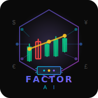

<div align="center">
  
  
  # Factor AI (因子智投)
  
  ### 🤖 基于多智能体的智能金融分析平台
  
  [](https://opensource.org/licenses/Apache-2.0)
  [](https://www.python.org/)
  [](https://www.typescriptlang.org/)
  [](https://reactjs.org/)
  
</div>

---

## 📖 项目简介

**Factor AI（因子智投）** 是一个基于大语言模型（LLM）的多智能体金融分析平台，通过模拟专业投资团队的协作流程，为投资者提供全面、深度的股票分析报告。

### 🎯 核心特性

- 🤖 **多智能体协作** - 模拟真实投资团队，包含分析师、研究员、交易员等多个角色
- 📊 **全市场覆盖** - 支持美股、A股、港股三大市场的实时分析
- 🧠 **多模型支持** - 集成DeepSeek、通义千问、Gemini等多个主流LLM
- 🎨 **现代化界面** - 基于React + Ant Design的响应式Web应用
- 🔐 **企业级认证** - 支持SSO单点登录和多级权限管理
- 📈 **实时分析** - 可视化分析进度，智能时间预估
- 📄 **专业报告** - 支持Markdown/Word/PDF多格式导出
- 🐳 **容器化部署** - Docker一键部署，快速上手

---

## 🚀 快速开始

### Docker部署（推荐）

```bash
# 1. 克隆项目
git clone https://github.com/Robin021/FactorAI.git
cd FactorAI

# 2. 配置环境变量
cp .env.example .env
# 编辑 .env 文件，填入必要的API密钥

# 3. 启动服务
docker-compose up -d

# 4. 访问应用
# 前端: http://localhost:3000
# 后端API: http://localhost:8000
```

### 本地开发

#### 后端启动

```bash
# 1. 创建虚拟环境
python -m venv venv
source venv/bin/activate  # Windows: venv\Scripts\activate

# 2. 安装依赖
pip install -e .

# 3. 启动后端
cd backend
uvicorn app.main:app --reload --host 0.0.0.0 --port 8000
```

#### 前端启动

```bash
# 1. 安装依赖
cd frontend
npm install

# 2. 启动开发服务器
npm run dev
```

---

## 🤖 智能体团队

### 分析师团队

| 智能体 | 职责 | 分析内容 |
|--------|------|----------|
| 📈 **市场技术分析师** | 技术面分析 | K线形态、技术指标、趋势判断 |
| 💰 **基本面分析师** | 基本面分析 | 财务数据、估值分析、行业地位 |
| 📰 **新闻分析师** | 新闻情绪分析 | 新闻事件、市场情绪、舆情监控 |
| 💬 **社交媒体分析师** | 社交情绪分析 | 社交媒体讨论、投资者情绪 |

### 研究团队

| 智能体 | 职责 | 工作方式 |
|--------|------|----------|
| 🐂 **看涨研究员** | 寻找买入理由 | 挖掘积极因素，构建看涨论据 |
| 🐻 **看跌研究员** | 寻找风险点 | 识别风险因素，构建看跌论据 |
| 🎯 **交易决策员** | 最终决策 | 综合双方观点，给出投资建议 |

---

## 📊 支持的市场

| 市场 | 代码格式 | 示例 |
|------|----------|------|
| 🇺🇸 **美股** | 股票代码 | `AAPL`, `TSLA`, `NVDA` |
| 🇨🇳 **A股** | 6位数字 | `000001`, `600519`, `300750` |
| 🇭🇰 **港股** | 代码.HK | `0700.HK`, `9988.HK`, `3690.HK` |

---

## 🧠 支持的LLM模型

### 国产模型（推荐）

| 提供商 | 模型 | 特点 |
|--------|------|------|
| 🇨🇳 **DeepSeek** | deepseek-chat | 性价比极高，工具调用强 |
| 🇨🇳 **阿里百炼** | qwen-turbo/plus/max | 中文优化，响应快速 |
| 🇨🇳 **百度千帆** | ERNIE系列 | 企业级支持 |

### 国际模型

| 提供商 | 模型 | 特点 |
|--------|------|------|
| 🌍 **Google AI** | Gemini 2.0/2.5 | 最新旗舰，多模态 |
| 🌍 **OpenAI** | GPT-4o | 经典强大 |
| 🌍 **Anthropic** | Claude 4 | 推理能力强 |

---

## 🔐 环境变量配置

### 必需配置

```bash
# LLM API密钥（至少配置一个）
DEEPSEEK_API_KEY=your_deepseek_api_key
DASHSCOPE_API_KEY=your_dashscope_api_key
GOOGLE_API_KEY=your_google_api_key

# 数据源API密钥
FINNHUB_API_KEY=your_finnhub_api_key
TUSHARE_TOKEN=your_tushare_token  # 推荐配置
```

### 可选配置

```bash
# 数据库配置
MONGODB_ENABLED=true
REDIS_ENABLED=true

# SSO认证配置
AUTHING_APP_ID=your_authing_app_id
AUTHING_APP_HOST=your_authing_host
```

---

## � 项目结构管

```
FactorAI/
├── frontend/              # React前端应用
├── backend/               # FastAPI后端服务
├── tradingagents/         # AI智能体核心
├── assets/                # 资源文件（Logo等）
├── docs/                  # 文档
├── docker-compose.yml     # Docker编排
└── README.md             # 本文件
```

---

## 🤝 贡献指南

我们欢迎所有形式的贡献！

1. Fork 本项目
2. 创建特性分支 (`git checkout -b feature/AmazingFeature`)
3. 提交更改 (`git commit -m 'feat: Add some AmazingFeature'`)
4. 推送到分支 (`git push origin feature/AmazingFeature`)
5. 开启 Pull Request

---

## 📄 开源协议

本项目基于 [Apache License 2.0](LICENSE) 开源协议。

---

## 🙏 致谢

本项目基于 [TauricResearch/TradingAgents](https://github.com/TauricResearch/TradingAgents) 进行深度定制和增强开发。

---

## 📞 联系我们

- **项目主页**: https://github.com/Robin021/FactorAI
- **问题反馈**: https://github.com/Robin021/FactorAI/issues

---

<div align="center">
  
  **Built with ❤️ by Factor AI Team**
  
  © 2024 Factor AI. All rights reserved.
  
</div>
