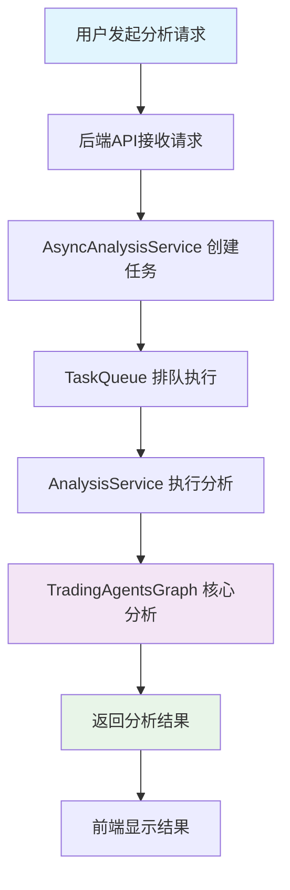
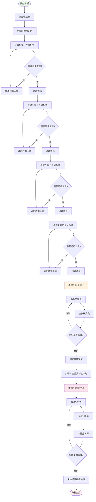
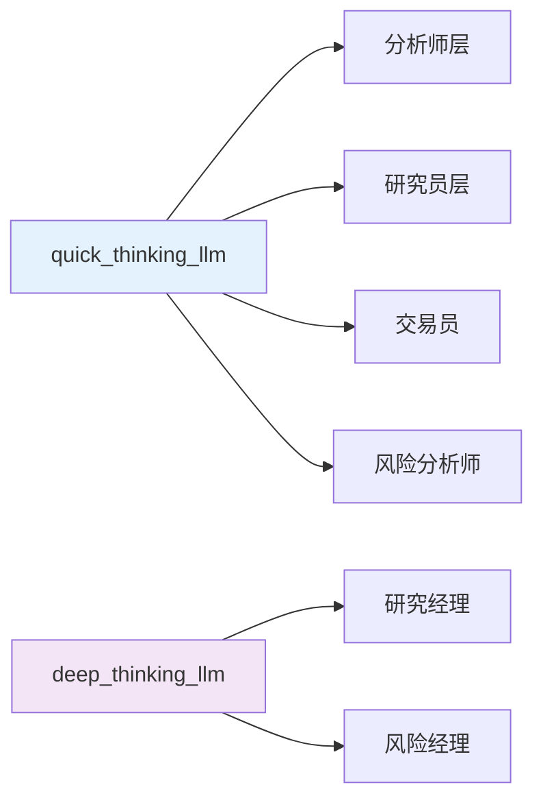
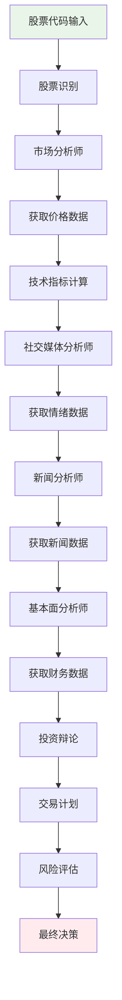

# 🏗️ TradingAgents 股票分析完整流程图

## 📋 总体架构

## 🔄 分析师执行顺序（顺序执行，非异步）

### 📊 核心分析流程

## 🎯 分析师类型和职责

### 📈 核心分析师（顺序执行）

| 分析师 | 职责 | 调用的LLM | 数据源 | 执行顺序 |
|--------|------|-----------|--------|----------|
| **市场分析师** | 技术分析、价格走势、交易量 | quick_thinking_llm | YFin、StockStats | 第1个 |
| **社交媒体分析师** | 投资者情绪、社交讨论 | quick_thinking_llm | Reddit、新闻API | 第2个 |
| **新闻分析师** | 新闻事件、政策影响 | quick_thinking_llm | Google News、Finnhub | 第3个 |
| **基本面分析师** | 财务数据、估值分析 | quick_thinking_llm | SimFin、Finnhub | 第4个 |

### 🤔 决策层（顺序执行）

| 角色 | 职责 | 调用的LLM | 执行阶段 |
|------|------|-----------|----------|
| **多头研究员** | 提出买入论据 | quick_thinking_llm | 投资辩论 |
| **空头研究员** | 提出卖出论据 | quick_thinking_llm | 投资辩论 |
| **研究经理** | 综合辩论，做出投资决策 | deep_thinking_llm | 投资决策 |
| **交易员** | 制定具体交易计划 | quick_thinking_llm | 交易计划 |

### ⚠️ 风险管理层（顺序执行）

| 角色 | 职责 | 调用的LLM | 风险偏好 |
|------|------|-----------|----------|
| **激进分析师** | 高风险高收益策略 | quick_thinking_llm | 激进 |
| **保守分析师** | 低风险稳健策略 | quick_thinking_llm | 保守 |
| **中性分析师** | 平衡风险收益 | quick_thinking_llm | 中性 |
| **风险经理** | 最终风险评估和决策 | deep_thinking_llm | 综合 |

## 🔧 LLM调用模式

### 🧠 LLM类型分工

- **quick_thinking_llm**: 用于快速分析和数据处理（如 gpt-4o-mini）
- **deep_thinking_llm**: 用于深度思考和最终决策（如 o1-mini）

### 🔄 执行特点

1. **顺序执行**: 所有分析师按照预定顺序依次执行，不是异步并行
2. **工具调用**: 每个分析师可能多次调用数据工具获取信息
3. **状态传递**: 前一个分析师的结果会传递给下一个分析师
4. **进度跟踪**: 每个步骤都有进度回调更新

## 📊 数据流向

## ⏱️ 时间统计

### 📈 进度阶段

| 阶段 | 进度% | 描述 | 预估时间 |
|------|-------|------|----------|
| 股票识别 | 0-5% | 验证股票代码，获取基本信息 | 5-10秒 |
| 市场分析 | 5-25% | 技术分析，价格走势分析 | 30-60秒 |
| 社交媒体分析 | 25-40% | 情绪分析，社交讨论 | 20-40秒 |
| 新闻分析 | 40-55% | 新闻事件分析 | 20-40秒 |
| 基本面分析 | 55-70% | 财务数据分析 | 30-60秒 |
| 投资辩论 | 70-85% | 多空辩论，投资决策 | 30-45秒 |
| 交易计划 | 85-95% | 制定具体交易策略 | 15-30秒 |
| 风险评估 | 95-100% | 风险分析，最终决策 | 15-30秒 |

### ⏰ 总体时间

- **最短时间**: 约2-3分钟
- **平均时间**: 约3-5分钟  
- **最长时间**: 约5-8分钟（取决于数据获取和LLM响应速度）

## 🔍 关键特点

1. **顺序执行**: 分析师按固定顺序执行，确保信息逐步积累
2. **工具调用**: 每个分析师可以调用多个数据工具
3. **状态共享**: 所有分析师共享同一个状态对象
4. **进度跟踪**: 实时更新分析进度
5. **内存机制**: 支持历史经验学习和反思
6. **多轮辩论**: 投资和风险决策支持多轮讨论

## 🚀 优化建议

1. **并行化**: 可以考虑将独立的分析师并行执行
2. **缓存机制**: 对相同股票的重复分析可以使用缓存
3. **智能路由**: 根据股票类型选择不同的分析师组合
4. **动态超时**: 根据分析复杂度动态调整超时时间